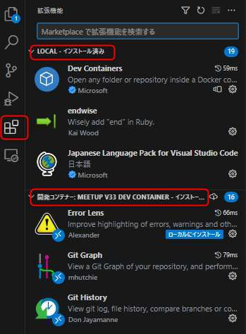

# 2. Docker + VSCode の構築

<!-- toc -->

## 2.1. プロジェクトのクローン～VSCodeの起動

あなた「大友さん、このプロジェクト全然わかんないんですけどとりあえずどうしたらいいですかね？」

大友「devcontainer.json があるのでクローンして VSCode で開いてみよう」

```
git clone https://github.com/miracleave-ltd/mirameetVol33.git

cd mirameetVol33

code .
```

コンテナで再度開くを選択


ウインドウが表示されない場合は左下からコンテナで再度開く


左下に開発コンテナと表示されていれば成功


## 2.2. 開発コンテナーについて

あなた「コンテナで再度開くってなんですか？」

大友「コンテナの中の VSCode に接続することだよ」


あなた「別の VSCode を開いてるってことはプラグインも入れ直しですか？」

大友「devcontainer.json にプラグインの設定があるので不要」



大友「実行設定の Debug v33 web から Rails を起動する」

`http://localhost:3000/`

画面が表示されれば環境構築完了


## 2.3. 各ファイルの解説

**Dockerfile**

元になるイメージと変更する手順を記述する。
今回は ruby のバージョン 3.2.2 を指定しています。
また、Docker イメージのビルドはキャッシュが利用できるので `Gemfile` を先に追加して `bundle install` をすることにより、時間のかかるインストール処理をキャッシュすることができます。

**docker-compose.yml**

複数のコンテナをまとめて管理するための定義です。
今回は DB のコンテナである `v33_db`, Rails を起動する `v33_web`, ドキュメントページを起動する `v33_doc` の3つのコンテナを定義しています。

※ファイル内容の細かい解説が必要？

**.devcontainer/devcontainer.json**

コンテナ内の VSCode についての定義です。
VSCode を起動するコンテナの指定やインストールするプラグインを定義できます。
