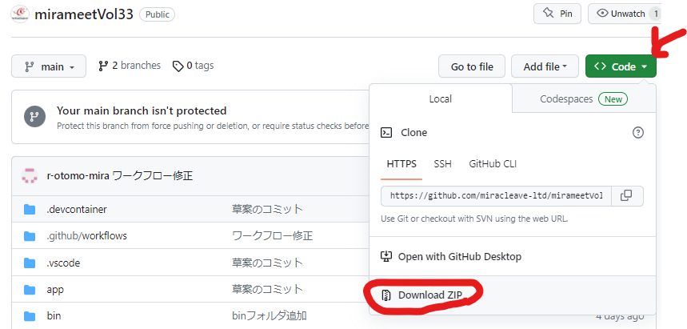
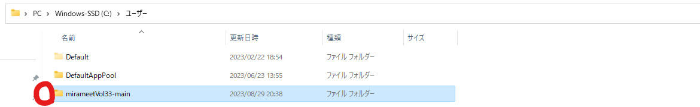
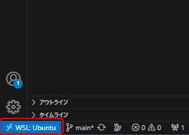
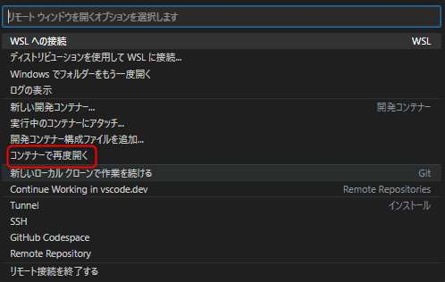
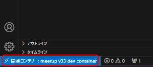
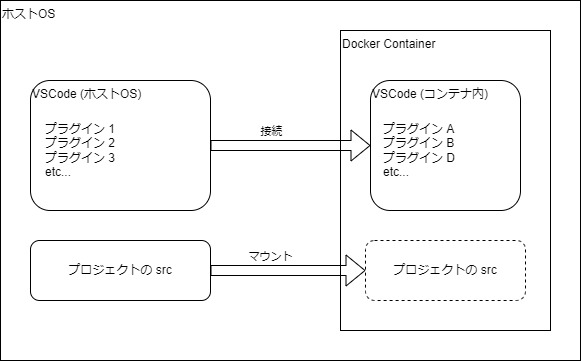
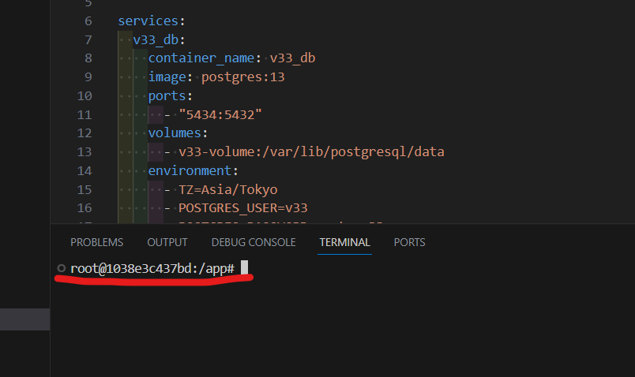
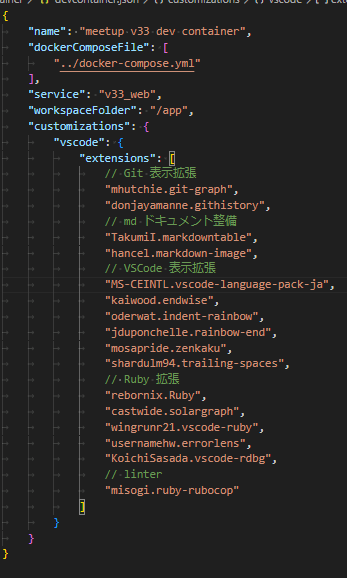
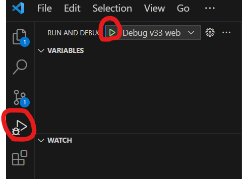
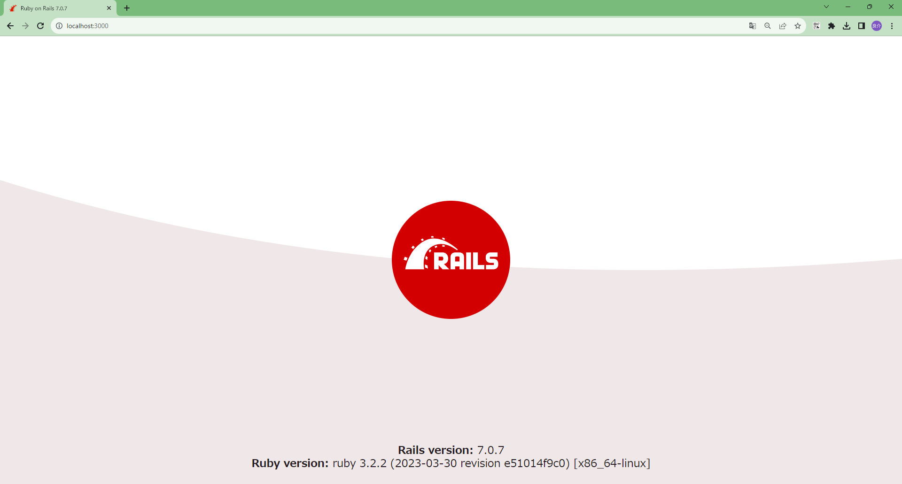

# 2. Docker + VSCode の構築

<!-- toc -->

## 2.1. プロジェクトのダウンロード

github ページ：https://github.com/miracleave-ltd/mirameetVol33

`mirameetVol33-main.zip`を解凍し、そのディレクトリをユーザー直下に配置します。<br>※画像は Windows の場合




## 2.2. 配置したフォルダを VScode で起動

```
# Windows
cd C:\Users\mirameetVol33-main
# Mac
cd ~/mirameetVol33-main

# Windows・Mac共通
code .
```

## 2.3. コンテナ内のフォルダを VSCode で開く

Dev Container 拡張機能を利用し、コンテナ内の VScode に接続します。

・コンテナで再度開くを選択


・ウインドウが表示されない場合は左下からコンテナで再度開く





・左下に開発コンテナと表示されていれば成功です



## 補足：開発コンテナーについて



2.2 で開いたものとは別の VSCode が立ち上がります。

立ち上がると Explorer 上にはコンテナ内にマウントされたソースコードが表示されるようになります。

よく 'Docker コンテナの中に入る' という表現を使うかと思います。以下のようなコマンドですね。

> docker container exec -it コンテナ名 bash 等

コマンドからですと、CUI ベースで取っ付きにくい方も多いかと思いますが、この Dev Container ではほぼ同様のことを GUI（VSCode の見た目）ベースで操作出来るので、その点が大きなメリットとなります。

VSCode のターミナルも以下のようにコンテナ内に入った時のように表示されます。



devcontainer.json の設定により、VSCode のプラグインのインストールし直しは不要となります。

実際に JSON ファイルと、インストール済みの拡張機能を確認してみましょう！

〇.devcontainer\devcontainer.json



〇拡張機能


## 2.4. Rails プロジェクトを起動

ターミナルにて、以下コマンドを実行しデータベースの作成を行う

```ruby
rails db:create
```

その後、実行設定の Debug v33 web から Rails を起動する



以下 URL をブラウザに入力し、画面が表示されれば環境構築は完了となります

`http://localhost:3001/`


## 補足：各ファイルの解説

**Dockerfile**

元になるイメージと変更する手順を記述する。
今回は ruby のバージョン 3.2.2 を指定しています。
また、Docker イメージのビルドはキャッシュが利用できるので `Gemfile` を先に追加して `bundle install` をすることにより
時間のかかるインストール処理をキャッシュすることができます。

**docker-compose.yml**

複数のコンテナをまとめて管理するための定義です。

今回は DB のコンテナである `v33_db`, Rails を起動する `v33_web`, メールサーバーを起動する `v33_mail` の 3 つのコンテナを定義しています。

また、DB のデータ永続化する為に、`v33-volume` というボリュームも定義しています。

**.devcontainer/devcontainer.json**

コンテナ内の VSCode についての定義です。
VSCode を起動するコンテナの指定やインストールするプラグインを定義できます。
