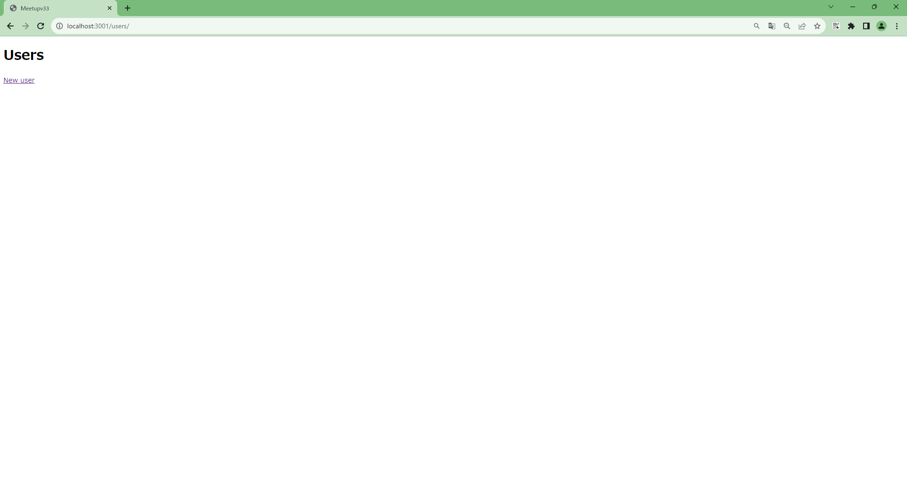
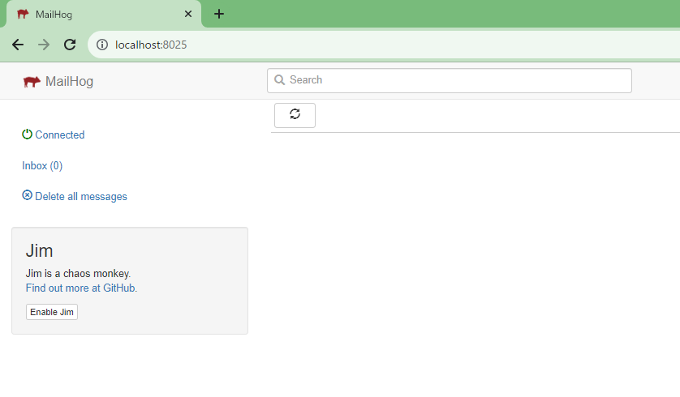

# 3. 外部連携のモック化

<!-- toc -->

開発用メールサーバーを利用して簡単なメール送信機能を作成して
動作確認してみましょう。

今回は`mailhog` というメールサーバーを用意します。Docker 公式にてイメージが提供されています。

mailhog は docker-compose.yml の以下部分に定義されており、DevContainer 起動時点で
既に環境が作成されており使用できる状態です。

```
  v33_mail:
    container_name: v33_mail
    image: mailhog/mailhog
    ports:
      - "8025:8025"
```

### ユーザー画面管理画面作成

Rails の scaffold 機能を使用して、簡単なユーザー画面を作成します。

はじめに以下コマンドを実施します。

```Ruby
rails g scaffold User name:string email:string
```

ユーザー用のモデルが作成されましたので、その内容を DB へ反映する為にマイグレーションをしましょう。

```Ruby
rails db:migrate
```

### メール送信機能追加

Rails 組み込みの ActionMailer を使いメール機能の実装をします。

```
rails generate mailer User
```

作成された user_mailer.rb を以下の通り修正します。

〇 app\mailers\user_mailer.rb

```
class UserMailer < ApplicationMailer
  default from: 'noreply@meetup.com'

  def welcome_email
    @user = params[:user]

    mail(
      subject: '登録完了',
      to: @user.email
    )
  end
end
```

メールの本文に設定する内容を記載します。

```
touch app/views/user_mailer/welcome_email.text.erb
```

作成されたメール本文定義ファイルに以下の通り記載しましょう。

〇 app/views/user_mailer/welcome_email.text.erb

```
<%= @user.name %>様

新規登録ありがとうございます。

引き続きミートアップをお楽しみください。

```

ユーザー機能のコントローラに対して、以下差分となっている追加行を記載します。

〇 app/controllers/users_controller.rb

```diff
# POST /users or /users.json
def create
  @user = User.new(user_params)

  respond_to do |format|
    if @user.save
+      UserMailer.with(user: @user).welcome_email.deliver_later
      format.html { redirect_to user_url(@user), notice: "User was successfully created." }
      format.json { render :show, status: :created, location: @user }
    else
      format.html { render :new, status: :unprocessable_entity }
      format.json { render json: @user.errors, status: :unprocessable_entity }
    end
  end
end
```

最後に環境定義ファイルにメール送信先の設定を記載して準備完了です。

〇 config/enviroments/development.rb

```
config.action_mailer.delivery_method = :smtp
config.action_mailer.smtp_settings = { address: 'v33_mail', port: 1025 }
```

以下アドレスからユーザー画面を確認してみましょう。任意のユーザーを登録した後にメールが送信されます。

http://localhost:3001/users/



送信された内容を mailhog から確認してみましょう！

http://localhost:8025/

※疑似的なメール画面が表示されるはず



### 補足：その他開発用のメールサーバーについて

Rails の場合は [letter_opener](https://github.com/ryanb/letter_opener) という Gem が存在します。

こちらも Rails でのメール開発を行う際の選択肢の一つに挙げられます。
