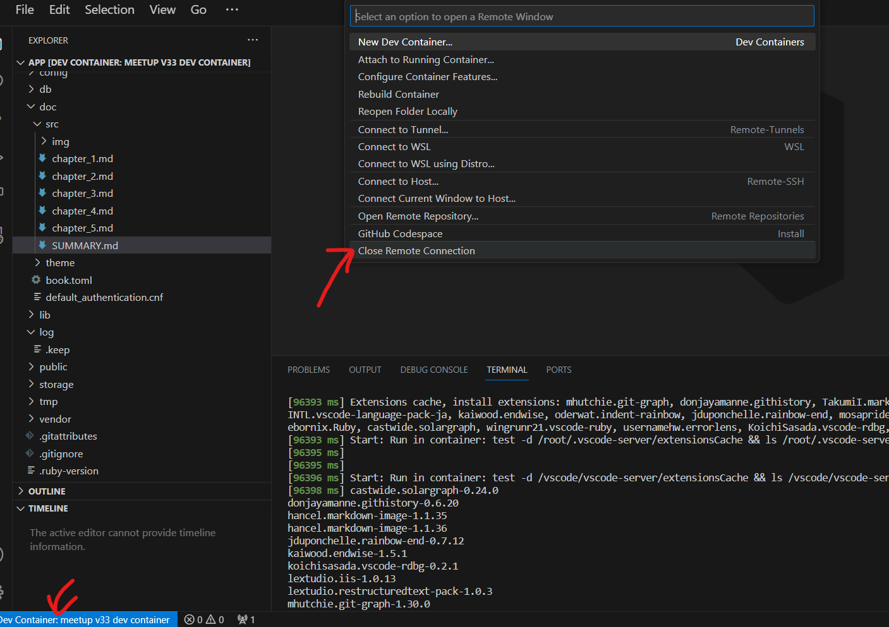

# 4. DB のバージョンアップ

<!-- toc -->

## 4.1 別バージョンの DB を起動

Docker で環境構築するメリットとして、ミドルウェアのバージョンアップを容易に実施することが出来ることが挙げられます。

ローカル環境に直接 PostgreSQL がインストールされている場合は、単純に pg_upgrade すれば良い場面もあるかもしれませんが、
例えば、案件 A：ver13、案件 B：ver13 の状態で案件 A だけ 15 にアップデートしたい！ という状況だといかがでしょう？

PC を複数台用意する訳にも行かず困ってしまいますよね？

現在 PostgreSQL13 で当システムは起動しているので、15 にアップデートしてみましょう。

### バックアップを取得

バージョン 13 のコンテナからバックアップを取得します。
以下をコマンドプロンプトより実行します。

```bash
docker-compose exec v33_db pg_dump --clean --username v33 meetupv33_development > backup.sql
```

その後データベースコンテナの削除を行います。

```bash
docker container rm [コンテナID]
```

ボリュームも同様に削除します。

```bash
docker volume rm mirameetvol33-main_v33-volume
```

### バージョンをアップデート

・docker-compose.yml

```diff
  v33_db:
    container_name: v33_db
-    image: postgres:13
+    image: postgres:15
    ports:
      - "5432:5432"
    volumes:
      - v33-volume:/var/lib/postgresql/data
    environment:
      - TZ=Asia/Tokyo
      - POSTGRES_USER=v33
      - POSTGRES_PASSWORD=meetupv33
```

Dev Container の接続を一度閉じて、再度接続する。



### リストア

```bash
docker-compose exec -T v33_db psql --username v33 -d meetupv33_development -f backup.sql
```

ユーザーの登録が出来るか動作確認をして問題無ければ DB のバージョンアップは完了となります。

### 補足：ボリュームとコンテナの単純再作成

ローカル環境においては、既に登録済みのデータを諦めることが出来るのであれば
途中のバックアップやリストアの手順をスキップして単純にコンテナの再作成をすることでアップデートをすることも可能です。
テストデータが seed で用意されているのであれば、よほど特殊なデータで無い限りは単純再作成でも良いかもしれません。
